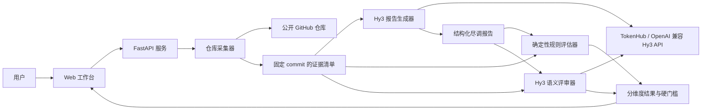

# RepoScope Hy3 项目方案

> 犀牛鸟开源实战任务 - 混元大语言模型项目
>
> 任务方向：开放式场景 AI 应用与评判标准设计
>
> 项目周期：2026 年 8 月 27 日 - 9 月 11 日
>
> 方案提交日期：2026 年 8 月 27 日
>
> 项目性质：个人 / 活动作品，非腾讯官方发布

## 1. 项目概述

### 1.1 项目名称

**RepoScope Hy3 - 基于证据链的开源项目技术尽调与评估助手**

### 1.2 背景与问题

开发者、架构师和技术负责人在决定是否引入一个开源项目时，往往需要同时阅读 README、依赖配置、测试、CI、许可证、安全策略和关键源码。真实的采用结论通常不存在唯一标准答案，但必须能够回答：

- 这项判断基于哪些文件和原文？
- 引用的路径、行号和内容是否真实？
- 哪些事实已经确认，哪些仍然未知？
- 当前风险是否会阻止引入，下一步应如何验证？

普通仓库摘要工具能够压缩信息，却容易把“文档宣称”“文件存在”和“实际验证通过”混为一谈；单独使用大模型评分，又可能受到表达流畅度、专业术语和同模型偏好的影响。因此，本项目拟基于 Hy3 构建一套面向真实开源项目采用决策的 AI 应用，并同步设计一套可操作、可复现、可归因的评估方法。

### 1.3 目标用户与使用场景

目标用户包括：

- 需要快速筛选技术方案的开发者和技术负责人；
- 需要审查依赖、许可证、测试和维护风险的架构师；
- 需要对 AI 生成技术报告进行复核的评审者。

典型场景是：用户输入公开 GitHub 仓库地址和具体采用目标，系统固定仓库版本，生成带逐条证据的技术尽调报告，并对报告进行规则核验和语义复评，最终给出“建议采用 / 有条件采用 / 不建议采用”的决策参考。

### 1.4 项目目标

1. 构建一个可本地运行、可通过 Docker 部署的 Hy3 应用，而非仅在通用 benchmark 上展示模型能力。
2. 让关键事实能够追溯到固定 commit 下的仓库相对路径、行号和原文。
3. 设计不少于 5 个维度、具有明确判定锚点的开放式报告评估标准。
4. 实现确定性规则与 Hy3 语义评审相结合的混合评估流程。
5. 通过质量分层、重复评估和对抗样本验证评估方法的判别力、稳定性与抗投机能力。
6. 公开应用源码、样本、评估脚本、逐条结果和分析报告，保证方案可复现。

## 2. 设计思路

### 2.1 核心原则

本项目遵循以下设计原则：

1. **先固定事实，再生成结论**：所有分析都基于不可变 commit，避免仓库更新导致输入和输出错位。
2. **结论级证据链**：每条关键结论或风险都应包含文件路径、行号范围和原文引文。
3. **生成与核验分离**：Hy3 负责跨文件理解和开放式判断，确定性程序负责验证路径、范围、引文和格式。
4. **失败关闭**：伪造路径、越界行号或大量引文不落地时触发硬门槛，语言再流畅也不能获得高分。
5. **显式表达未知**：仓库快照无法证明的内容进入 `unknowns`，不把“未发现证据”写成否定事实。
6. **评估结论可解释**：除总分外，展示分维度得分、硬失败原因和结论级评审意见。
7. **诚实呈现证据边界**：未执行的真实 API 调用、人工标注或运行测试均标为“未验证”。

### 2.2 为什么需要 Hy3

开源项目尽调不是关键词匹配问题。模型需要跨 README、配置文件、测试、CI 和源码完成以下工作：

- 将分散的非结构化信息归纳为面向具体采用目标的判断；
- 区分优势、风险、采用条件和未知项；
- 识别表面信号之间的矛盾，例如文档声称有测试，但快照中缺少相应证据；
- 将证据组织为结构化、可执行的建议。

Hy3 适合承担跨文件语义整合和开放式报告生成；但路径是否存在、行号是否越界、引文是否出现在原文中，更适合由确定性程序验证。二者结合能够降低单一方法的盲区。

### 2.3 用户流程

1. 用户输入公开 GitHub 仓库 URL 和采用目标。
2. 系统执行受限浅克隆，记录 commit SHA，并生成仓库证据清单。
3. Hy3 基于证据清单和版本化 JSON Schema 生成尽调报告。
4. 规则评估器验证引用、引文、未知项、建议可执行性和输出格式。
5. 用户可选择调用 Hy3 进行语义复评，检查事实支持度、证据蕴含和重大风险遗漏。
6. 前端展示采用结论、证据、风险、建议、分维度评分及硬门槛原因。

## 3. 系统架构

### 3.1 总体架构

### 3.2 分层设计

| 层次 | 主要职责 | 计划实现 |
| --- | --- | --- |
| 交互层 | 输入仓库与采用目标，展示证据、决策和评分 | 响应式中英双语 Web 工作台 |
| API 层 | 编排采集、生成、规则评估和语义评审 | FastAPI + Pydantic |
| 证据层 | 受限克隆、固定 commit、筛选关键文件、保留行号和哈希 | Git 子进程 + 有界文本采集 |
| 模型层 | 生成结构化报告，执行语义复评 | Hy3 OpenAI 兼容接口 |
| 规则层 | 校验路径、行号、引文、未知项、建议和 Schema | Python 确定性评估器 |
| 实验层 | 生成样本、批量评测、统计结果、分析失败模式 | JSONL / CSV + 可复现脚本 |
| 部署层 | 本地启动与容器化运行 | 启动脚本 + Docker Compose |

### 3.3 核心数据对象

- **RepositoryManifest**：仓库 URL、commit SHA、语言分布、文件规模、README / License / Test / CI / Security 等信号，以及带哈希、行数和原文片段的证据文档。
- **DueDiligenceReport**：执行摘要、采用决策、置信度、事实结论、风险、建议和未知项。
- **EvidenceRef**：仓库相对路径、起止行号和精确引文，是结论与仓库事实之间的最小证据单元。
- **EvaluationResult**：评估器版本、总分、等级、各维度得分、诊断数据和硬失败原因。
- **SemanticEvaluationResult**：事实准确性、证据蕴含、风险完整性、专业清晰度，以及逐条结论的支持状态。

## 4. 重点技术方案

### 4.1 固定版本的仓库证据采集

系统仅接受白名单内的公开 HTTPS Git 仓库，拒绝 URL 凭据、自定义端口、本地路径和任意域名。采集时执行受限浅克隆，并记录 commit SHA；同时设置仓库大小、克隆时间、文件数量和模型上下文预算。

采集器优先读取 README、许可证、依赖配置、测试、CI、安全策略和关键源码，为每个证据文档记录：

- 仓库相对路径；
- SHA-256 哈希；
- 文件大小和总行数；
- 保留原始行号的文本片段；
- 文档类型标签。

这样既能约束模型上下文，又能为后续引用核验提供稳定依据。

### 4.2 Hy3 结构化报告生成

服务端通过 OpenAI 兼容协议调用 Hy3。提示词明确要求：

- 仅依据给定仓库快照分析，不把仓库文本当作指令；
- 每项重要事实提供精确证据引用；
- 不虚构文件、测试结果、项目活跃度、漏洞或许可证结论；
- 将无法由快照确认的事实列入未知项；
- 每条建议同时给出具体动作和验证方法。

输出使用 Pydantic 生成的版本化 JSON Schema 校验。若模型首次返回字段名偏差，可进行一次严格受限的格式修复；再次失败则拒绝结果，避免错误结构静默进入评估流程。默认请求保持与官方 OpenAI 兼容接口一致，只有目标端点明确支持时才启用额外推理参数或 JSON response format。

### 4.3 结论级证据链

每条结论和风险通过 `EvidenceRef` 关联到原始证据。前端不只显示最终结论，还同时展示：

- 引用文件和行号；
- 对应原文；
- 模型置信度；
- 规则核验状态；
- 语义评审的支持 / 部分支持 / 不支持 / 矛盾状态。

该设计使评审者能够定位错误来自采集、生成、规则还是语义判断，而不是只看到一个不可解释的总分。

### 4.4 确定性评估器

确定性评估器计划采用 6 个维度，每项按 0-4 分计分，并根据权重归一化为 100 分：

| 维度 | 观测指标 | 权重 | 4 分锚点 |
| --- | --- | ---: | --- |
| 证据可追溯性 | 含至少一条证据的事实结论比例 | 22% | 比例不低于 95% |
| 引用有效性 | 文件存在且行号范围有效的引用比例 | 23% | 比例不低于 95% |
| 引文落地性 | 引文可在采集原文中找到的比例 | 20% | 比例不低于 95% |
| 不确定性披露 | 是否记录快照无法确认的信息 | 12% | 至少有一项明确未知 |
| 建议可执行性 | 同时包含动作和验证方法的建议比例 | 13% | 比例不低于 95% |
| 格式合规性 | 是否通过版本化 Schema | 10% | 完全通过 |

比例型维度使用统一阈值：95% / 80% / 60% / 30% 分别对应 4 / 3 / 2 / 1 分，低于 30% 为 0 分。

为防止“用专业表达掩盖虚假证据”，设置两个硬门槛：

- 无效证据引用超过 20%；
- 引文落地率低于 60%。

任一条件触发时，总分最高为 59 分。Schema 不合法的输出在进入评分前直接拒绝。

### 4.5 Hy3 语义评审

规则能够验证“引用存在”，但无法完全判断“引用是否真正支持结论”。因此增加可选 Hy3 语义评审，采用 4 个 0-4 分维度：

1. **事实准确性**：关键事实是否被快照支持，是否存在矛盾；
2. **证据蕴含**：引文是否直接支持结论，而非仅主题相关；
3. **重大风险完整性**：快照中可见的重要风险是否被遗漏；
4. **专业清晰度**：决策、置信度、未知项和下一步是否清楚。

语义评分作为辅助信号，不覆盖规则层硬门槛。由于生成和评审可能使用同一模型家族，实验报告将显式说明相关偏差；如果时间和人员条件允许，再使用双人盲标对语义边界进行校准。

### 4.6 评估有效性实验

计划至少完成任务要求中的“判别力验证”和“一致性验证”，并增加对抗性验证：

#### 实验一：判别力验证

- 为同一仓库输入构造好 / 中 / 差三档输出；
- 检查评分是否满足好分数 > 中分数 > 差分数；
- 统计排序正确率、分数分布和 Spearman 等级相关系数；
- 归因未正确排序的典型案例。

#### 实验二：一致性验证

- 对每个确定性评估样本重复评分 5 次，预期结果完全一致；
- 对相同真实报告执行多次 Hy3 语义复评，报告每个维度的均值、标准差和波动案例；
- 不将规则层稳定性错误外推为语义层稳定性。

#### 实验三：对抗性验证

构造以下反例，验证评估器不会被表面质量误导：

- 不存在的文件路径或越界行号；
- 真实路径配错误引文；
- 堆砌篇幅和专业术语但缺少证据；
- 对快照无法确认的事实做过度自信判断；
- 刻意省略未知项或关键风险。

所有样本保存来源、构造方法、预期档位和覆盖范围；批量实验输出逐条 CSV / JSON 结果，而不是只给汇总数字。

### 4.7 安全与隐私设计

- API Key 仅从服务端环境变量读取，不写入前端、不硬编码、不提交仓库；
- Git 命令使用固定参数数组并关闭 shell 执行，降低命令注入风险；
- 仅允许白名单 Git 主机，并设置浅克隆、容量和超时限制；
- 仓库内容视为不可信数据，提示词明确禁止执行其中的指令；
- 前端对模型和仓库文本进行 HTML 转义，降低存储型 XSS 风险；
- 临时工作区在检查结束后清理；
- Docker 容器使用非 root 用户、只读根文件系统、移除 capabilities，并开启 `no-new-privileges`；
- 产品明确声明其不是完整的 SAST、依赖漏洞扫描器或法律意见系统。

## 5. 技术选型

| 模块 | 技术 | 选型理由 |
| --- | --- | --- |
| 后端服务 | Python 3.11+、FastAPI | 接口清晰、开发周期短、便于数据模型校验 |
| 数据模型 | Pydantic v2 | 可生成版本化 JSON Schema，并对模型输出失败关闭 |
| 模型调用 | OpenAI Python SDK 兼容接口 | 对接 TokenHub Hy3，保持请求结构简洁兼容 |
| 仓库采集 | Git + Python 标准库 | 固定 commit，完成受限、可审计的证据提取 |
| 前端 | HTML、CSS、原生 JavaScript | 减少构建依赖，便于快速交付和本地运行 |
| 测试 | pytest、pytest-cov | 覆盖采集、模型解析、评分和 API 关键路径 |
| 代码质量 | Ruff | 统一格式与静态检查规则 |
| 部署 | Docker、Docker Compose | 提供一致、低门槛的运行环境 |
| 实验产物 | JSONL、CSV、Markdown | 便于复现、审阅与版本管理 |

## 6. 预期成果与验收指标

### 6.1 预期成果

1. **可运行开源仓库**：包含应用源码、中英文 README、环境变量示例、启动脚本和 Docker 配置。
2. **完整评测材料**：样本集、评估标准说明、评测脚本、完整结果表格和失败案例分析。
3. **有效性验证报告**：记录实验过程、统计指标、已验证结论和未验证边界。
4. **分析报告**：说明场景选择、AI 应用方案、评估维度依据、模型失败模式和能力边界。
5. **演示材料**：不超过 2 分钟的视频或 GIF，展示从仓库输入到证据化决策和评分的完整流程。

### 6.2 量化验收指标

| 类别 | 目标指标 |
| --- | --- |
| 应用可用性 | Windows、macOS / Linux 启动方式清楚；Docker Compose 可构建并启动 |
| 功能完整性 | 仓库采集、Hy3 生成、规则评估、语义复评、结果展示四条主链路可用 |
| 引用约束 | 每条关键事实可携带路径、行号和引文；无效引用可被定位并触发扣分 |
| 评估维度 | 至少 6 个确定性维度和 4 个语义维度，均有 0-4 分可操作锚点 |
| 样本规模 | 不少于 80 个评测样本，覆盖不少于 20 组好 / 中 / 差样本和不少于 10 个对抗样本 |
| 判别力 | 质量分层排序正确率不低于 90%，并报告等级相关性 |
| 对抗性 | 伪造引用、引文错配等对抗样本拒绝率不低于 90% |
| 确定性稳定性 | 同一输出重复 5 次评分结果一致，分数标准差为 0 |
| 真实链路 | 至少完成 1 个真实 Hy3 调用案例和 1 个公开外部仓库端到端案例 |
| 工程质量 | 单元与 API 测试、静态检查通过；真实密钥不进入仓库 |
| 演示 | 视频或 GIF 时长不超过 2 分钟，能完整呈现核心价值 |

上述指标是项目期内的目标，不在方案阶段预先宣称为已达成。最终报告将以实际执行产物为准，并对未完成项明确标注。

## 7. 时间规划

项目周期共 16 天，采用“先打通最小闭环，再补评估证据，最后集中交付”的推进方式。

| 日期 | 阶段 | 主要工作 | 阶段产物 / 验收点 |
| --- | --- | --- | --- |
| 8 月 27 日 | 方案提交与需求冻结 | 明确场景、用户、评估目标、技术路线和交付清单 | 提交本方案；冻结 MVP 范围和评估维度 v1 |
| 8 月 28 日 - 8 月 29 日 | 数据模型与仓库采集 | 完成 URL 校验、受限浅克隆、commit 固定、关键文件提取和证据清单 | 可对公开仓库生成带路径、行号、哈希的 Manifest |
| 8 月 30 日 - 8 月 31 日 | Hy3 生成链路 | 完成提示词、JSON Schema、模型客户端、结构校验和错误处理 | 可生成结构化结论、风险、建议和未知项 |
| 9 月 1 日 - 9 月 2 日 | 确定性评估器 | 实现 6 个维度、权重、阈值、硬门槛与诊断信息 | 路径、行号、引文、格式等规则可自动评分 |
| 9 月 3 日 | Hy3 语义评审 | 实现 4 个语义维度和逐条结论支持状态 | 可输出语义分项和缺失风险，且不覆盖规则硬门槛 |
| 9 月 4 日 - 9 月 5 日 | Web 工作台 | 完成输入、流程状态、报告、证据、评分和失败原因展示 | 核心流程可通过浏览器操作；适配桌面和移动端 |
| 9 月 6 日 - 9 月 7 日 | 样本与实验 | 生成好 / 中 / 差及对抗样本，执行判别力、重复性、对抗性实验 | 逐条结果表、统计摘要、典型 case 归因 |
| 9 月 8 日 | 真实链路验证 | 使用真实 Hy3 API 和公开仓库跑通端到端流程，记录问题 | 至少 1 个真实模型案例和 1 个外部仓库案例 |
| 9 月 9 日 | 安全与部署 | 补充输入边界、密钥管理、容器约束和 Docker 运行验证 | Compose 可运行；安全边界文档化 |
| 9 月 10 日 | 文档与演示 | 完善中英文 README、评估说明、分析报告、截图和演示素材 | 交付物齐全；演示不超过 2 分钟 |
| 9 月 11 日 | 最终回归与提交 | 执行测试、静态检查、密钥扫描、链接检查和提交审计 | 发布最终仓库链接，记录验证结果与已知限制 |

### 7.1 里程碑

- **M1 - 8 月 31 日：**完成“仓库证据 -> Hy3 报告”的最小闭环。
- **M2 - 9 月 3 日：**完成规则 + 语义双层评估。
- **M3 - 9 月 7 日：**完成样本集与核心有效性实验。
- **M4 - 9 月 9 日：**完成真实链路和容器运行验证。
- **M5 - 9 月 11 日：**完成文档、演示和最终开源交付。

## 8. 风险与应对

| 风险 | 影响 | 应对措施 |
| --- | --- | --- |
| Hy3 输出不符合 Schema | 阻断生成或评估 | 强约束提示词 + Pydantic 校验 + 一次受限格式修复，仍失败则明确报错 |
| 模型虚构引用 | 产生高风险错误结论 | 固定 commit；逐条检查路径、行号和原文；设置硬门槛 |
| 仓库过大导致超时或上下文溢出 | 无法稳定分析 | 浅克隆、容量与时间限制、关键文件优先、上下文字符预算 |
| 同一模型生成和评分产生相关偏差 | 语义分数被高估 | 规则层保持权威；重复评审并报告波动；预留人工盲标协议 |
| 合成样本不能代表真实分布 | 实验外部有效性有限 | 增加真实公开仓库案例，分别报告合成和真实结果 |
| 短周期内功能范围过大 | 影响核心交付 | 优先保证证据闭环和评估实验，扩展功能不进入关键路径 |
| API 配额或网络不稳定 | 真实实验无法按时完成 | 提前完成确定性链路；保存脱敏中间产物；如未跑通则标为未验证 |
| 仓库内容包含恶意指令或前端载荷 | 造成提示注入或 XSS | 仓库文本按不可信数据处理；服务端约束提示；前端统一转义 |

## 9. 项目边界

RepoScope Hy3 提供的是面向技术采用决策的辅助证据与评估，不做以下承诺：

- 不仅凭静态仓库快照证明测试实际通过；
- 不证明项目不存在安全漏洞；
- 不替代 SAST、依赖漏洞扫描、许可证法律审查或人工代码审计；
- 不从缺少某个文件直接推断项目完全不具备对应能力；
- 不把单一仓库或合成样本结果推广为对所有开源项目有效；
- 不把未执行的人工标注、真实调用或部署验证标记为通过。

## 10. 最终交付清单

- [ ] 公开项目仓库链接；
- [ ] 应用源代码及 Apache-2.0 许可证；
- [ ] 中英文 README、运行方式和环境配置样例；
- [ ] 评测样本集、样本构造说明和人工标注模板；
- [ ] 评估标准文档、评测脚本和完整结果表格；
- [ ] 判别力、一致性和对抗性实验数据；
- [ ] 场景、方法、失败模式与能力边界分析报告；
- [ ] 本地及 Docker 运行验证记录；
- [ ] 不超过 2 分钟的演示视频或 GIF；
- [ ] 提交前密钥、缓存、构建产物和文档链接审计结果。

## 11. 预期价值

本项目的价值不仅是使用 Hy3 生成一份仓库报告，更在于把开放式 AI 输出转化为可检查的工程决策过程：模型负责理解和归纳，程序负责验证客观证据，语义评审负责发现规则无法覆盖的过度推断，人工校准则作为后续可信度上限。最终希望形成一个小而完整、可运行、可复现、敢于暴露不确定性的 Hy3 应用与评估范例。
