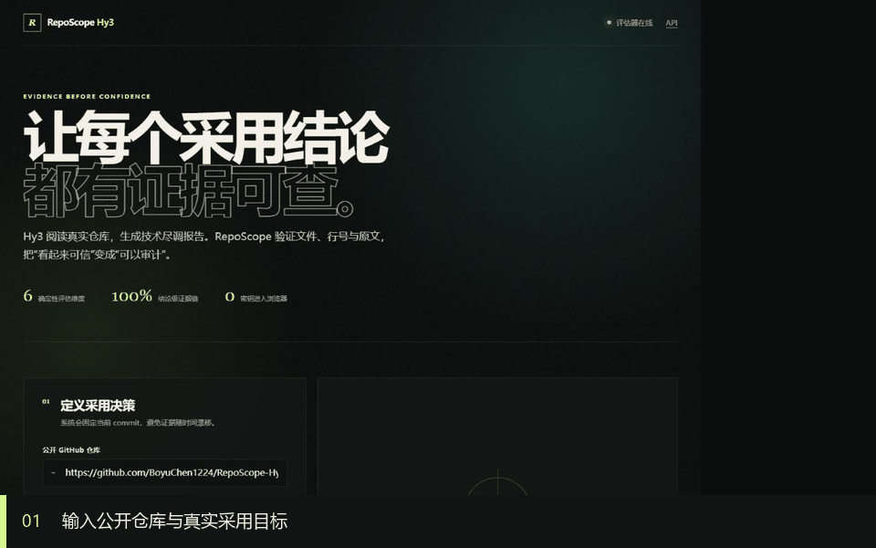

# RepoScope Hy3

> 个人 / 犀牛鸟活动作品，非腾讯官方发布。

RepoScope Hy3 是一个由 Hy3 驱动、强调证据可追溯性的开源项目技术尽调助手。它会把固定
commit 的仓库快照转换为采用建议，并逐条验证报告引用的文件、行号与原文，避免流畅但无
证据的结论获得高分。



## 为什么不是普通的仓库聊天机器人

- **结论级证据链：**每项关键事实引用仓库相对路径、行号和原文。
- **失败关闭：**伪造路径、越界行号和引文不匹配会触发硬门槛，总分最高 59。
- **混合评估：**确定性规则负责路径和原文，Hy3 语义评审负责事实蕴含与风险遗漏，人工标注
  用于校准一致性。
- **可复现实验：**样本、构造脚本、逐条结果和分析报告全部随仓库发布。
- **明确边界：**缺少真人标注或真实 API 调用时，结果保持“未验证”，不会显示成通过。

## 当前可验证结果

规则评估器 v1.1 已在 84 个合成样本上执行：

- 24 组好 / 中 / 差报告全部正确排序；
- 12 个伪造引用、引文错配和术语堆砌对抗样本全部触发拒绝；
- 每个样本重复 5 次，确定性分数标准差为 0；
- 好、中、差平均分分别为 100.0、61.5 和 18.5。

这些结果只证明规则层在构造样本上的行为，不代表真人一致性或 Hy3 真实输出质量。完整边界
见 [`reports/benchmark_analysis.md`](reports/benchmark_analysis.md)。
完整的场景选择、失败模式与能力边界见 [`reports/final_report.md`](reports/final_report.md)。

仓库还发布了 commit `ed167494e5c6` 上的真实自检案例：Hy3 在 20.523 秒内生成 5 条证据化
结论和 3 项风险；规则评估器 v1.1 对 12/12 个引用验证通过并得到 100 分；3 次 Hy3 语义复评
的各维度分数标准差均为 0。这只是一个真实案例，不能替代更大真实样本集或人工一致性验证。

## 快速启动

### Windows

```powershell
start.bat
```

### macOS / Linux

```bash
chmod +x start.sh
./start.sh
```

首次启动会由 `.env.example` 生成 `.env`。请在本地填写 `HY3_API_KEY`，不要将密钥提交到
Git。打开 <http://127.0.0.1:8000>；API 文档位于 <http://127.0.0.1:8000/docs>。

### Docker

```bash
cp .env.example .env
# edit .env locally
docker compose up --build
```

## 工作流

```text
GitHub URL + 采用目标
        │
        ▼
受限浅克隆 ──► 固定 commit ──► 证据清单
                                  │
                                  ▼
                           Hy3 结构化尽调报告
                                  │
                  ┌───────────────┴──────────────┐
                  ▼                              ▼
           确定性证据评估                  Hy3 语义评审
                  └───────────────┬──────────────┘
                                  ▼
                      分维度得分、硬门槛与归因
```

## 评估维度

确定性层包括证据覆盖、引用有效性、引文落地、不确定性披露、建议可执行性与格式合规。可选的
语义层包括事实准确性、证据蕴含、重大风险完整性和专业清晰度。评分锚点、权重和实验协议见
[`docs/EVALUATION.md`](docs/EVALUATION.md)。

## 安全设计

- 默认只接受白名单内的公开 HTTPS GitHub 仓库；
- 拒绝 URL 凭据、自定义端口、本地路径与任意域名；
- 浅克隆、容量、时间与模型上下文均有限额；
- 仓库文本视为不可信证据，不视为系统指令；
- 前端对模型及仓库文本进行 HTML 转义；
- API Key 只从服务端环境变量读取。

该项目不是完整的代码安全扫描器，也不能证明被分析项目不存在漏洞。生产部署前请阅读
[`SECURITY.md`](SECURITY.md)。

## 开发验证

```bash
python -m pip install -e ".[dev]"
python -m ruff check .
python -m pytest --cov=reposcope --cov-report=term-missing
python scripts/generate_benchmark.py
python scripts/run_experiments.py
```

## 许可证

Apache-2.0。
