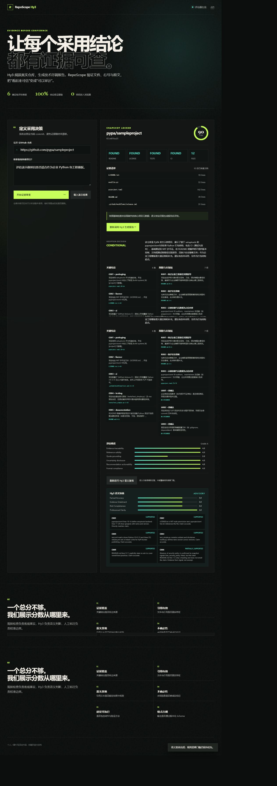

# Live browser end-to-end validation

## Scope

This run exercised the actual browser UI against a public repository and a live TokenHub Hy3 endpoint.
It was not the fixed demo path.

- Repository: `https://github.com/pypa/sampleproject`
- Frozen commit: `621e4974ca25`
- Adoption goal: assess suitability as an enterprise Python package project template
- Flow: repository clone -> evidence manifest -> Hy3 report -> deterministic evaluation -> Hy3 semantic
  evaluation

## Source-ingestion defect found and fixed

The first run incorrectly reported that the repository lacked a top-level license. The repository uses
`LICENSE.txt`, while inspector v1 only recognized `LICENSE`, `LICENSE.md`, and `COPYING`. Because both
the generator and semantic judge consumed the same faulty snapshot signal, both accepted the incorrect
premise.

The inspector now recognizes `LICENSE.txt`, `COPYING.txt`, `NOTICE`, and `NOTICE.txt`. A regression test
proves that a text-suffixed license is included in the evidence manifest and sets `has_license=true`.
The same repository commit was then re-imported before any new model call.

## Corrected live result

The corrected manifest contained 12 files and 10 evidence documents, including `LICENSE.txt`. Hy3
recommended conditional adoption: the repository is useful as a packaging-structure starting point but
does not claim to provide complete version-control, documentation, testing, or security best practices.

Deterministic evaluation:

| Dimension | Score (0-4) |
| --- | ---: |
| Evidence traceability | 4.0 |
| Reference validity | 4.0 |
| Quote grounding | 2.0 |
| Uncertainty disclosure | 4.0 |
| Recommendation actionability | 4.0 |
| Format compliance | 4.0 |
| **Overall** | **90 / 100, Grade A** |

Advisory Hy3 semantic evaluation:

| Dimension | Score (0-4) |
| --- | ---: |
| Factual accuracy | 3.0 |
| Evidence entailment | 3.0 |
| Risk completeness | 3.0 |
| Professional clarity | 4.0 |

Five claims were judged supported. Claim C006 was `partially_supported`: the snapshot signal directly
established that no security-policy file was captured, but the report cited README line 1, which is only
a heading and does not entail that claim. This is a concrete case where deterministic reference checks
and semantic entailment checks catch different failure classes.

## UI evidence

The full workflow rendered successfully in the desktop browser with no console errors. The semantic
section remained advisory and did not replace the deterministic score or hard-failure policy.

## Boundary

This is one interactive external-repository run. The browser session output was inspected and captured,
but it is not counted as a repeated stability experiment. The frozen self-repository case under
`results/live/ed167494e5c6/` remains the machine-readable live result with three semantic repetitions.

